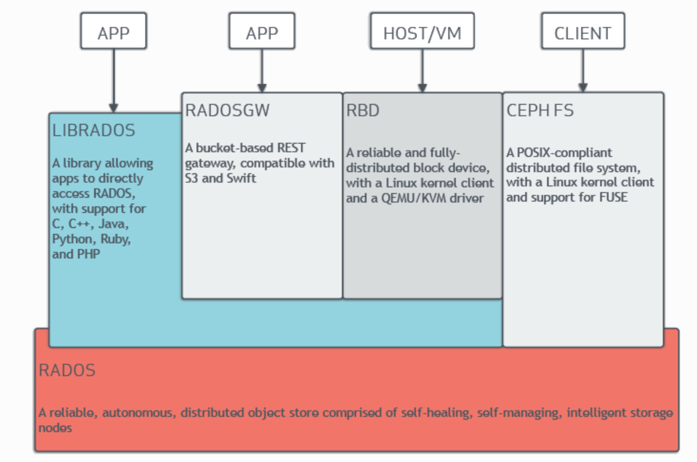

<h1 align="center">关于Ceph</h1>

## 1.Ceph的架构

Ceph 独特地在一个统一的系统中提供***对象（*object*）、块（block）和文件存储（file storage）***。

Ceph 高度可靠、易于管理且免费。 Ceph 的强大功能可以改变您公司的 IT 基础设施以及您管理大量数据的能力。 Ceph 提供非凡的可扩展性——数千个客户端访问 PB 到 EB 的数据。 Ceph 节点利用商用硬件和智能守护进程，Ceph 存储集群可容纳大量节点，这些节点相互通信以动态复制和重新分配数据。

### 1.Ceph存储集群

Ceph 提供基于 RADOS 的无限可扩展 Ceph 存储集群，RADOS 是一种可靠的分布式存储服务，它使用每个节点中的智能来保护其存储的数据并将该数据提供给客户端。

Ceph的存储集群由多种守护进程组成：

- Ceph Monitor

  > Ceph Monitor维护集群映射的主副本，并将其提供给 Ceph 客户端。 Ceph 集群中存在多个Monitor，可确保在其中一个Monitor守护进程或其主机发生故障时的可用性。

- Ceph OSD Deamon

  > Ceph OSD 守护进程用于，检查其***自身状态***和***其他 OSD 的状态***并向Monitor报告。

- Ceph Manager

  > Ceph Manager 充当监控、编排和插件模块的Endpoint。

- Ceph Metadata Server（MDS）

  > 当使用CephFS提供文件服务时，Ceph元数据服务器（MDS）管理***文件元数据***。

存储集群客户端和 Ceph OSD 守护进程，使用 CRUS 算法来计算有关数据位置的信息。通过使用 CRUSH 算法，客户端和 OSD 可以避免中央查找表造成的瓶颈。 Ceph 的高级功能包括通过 `librados` 与 Ceph 存储集群的本机接口以及构建在 `librados` 之上的许多服务接口。

#### 1. ***存储数据：***

Ceph 存储集群从 Ceph 客户端接收数据——无论是通过 ***Ceph 块设备***、***Ceph 对象存储***、***Ceph 文件系统***还是您使用 `librados` 创建的自定义实现。 Ceph存储集群将接收到的数据，存储为***RADOS对象***。每个对象都存储在，***对象存储设备（Object Storage Device）***（也称为“OSD”）上。 Ceph OSD 控制存储驱动器上的***读、写和复制***操作。默认的 BlueStore 后端以单一的、类似数据库的方式存储对象。

Ceph OSD 守护进程，将数据作为对象，存储在平面命名空间中。这意味着对象不存储在目录层次结构中。对象具有*标识符*、*二进制数据*和*由名称/值对组成的元数据*。 Ceph 客户端确定对象数据的语义。例如，CephFS 使用元数据来存储文件属性，例如文件所有者、创建日期和最后修改日期。

***注：*** Object ID 在整个集群中都是唯一的，而不仅仅是本地文件系统。

#### 2. ***可扩展性和高可用性：***

在传统架构中，客户端与集中式组件通信。这个集中式组件可能是网关、代理、API 或外观。这种集中式组件充当***复杂子系统的单一入口点***。依赖于这种集中式组件的架构存在单点故障，并且会导致性能和可扩展性受到限制。如果集中式组件出现故障，整个系统将变得不可用。

Ceph 消除了这个集中式组件。这使得客户端能够直接与 Ceph OSD 交互。 Ceph OSD 在其他 Ceph 节点上，创建对象副本，以确保***数据安全和高可用性***。 Ceph 还使用Monitor集群，来确保高可用性。为了消除中心化，Ceph 使用了一种称为 CRUSH 的算法。

**CRUSH介绍：**

Ceph 客户端和 Ceph OSD 守护进程，都使用 CRUSH 算法来计算，有关对象位置的信息，而不是依赖于中央查找表。 所以CRUSH 提供了比旧方法更好的数据管理机制；并且 CRUSH 通过将工作分配给，集群中的*所有 OSD 守护进程*以及*与它们通信的所有客户端*来实现大规模扩展。 CRUSH 使用智能数据复制来确保弹性，更适合超大规模存储。

**集群MAP：**

为了使 Ceph 集群正常运行，Ceph 客户端和 Ceph OSD 必须拥有有关集群拓扑的最新信息。当前信息存储在“集群MAP”中，它实际上是五个MAP的集合。构成集群MAP的五个图是：

1. **The Monitor Map**：

   > 包含集群 `fsid` 、每个Monitor的位置、名称、地址和 TCP 端口。监控图指定了当前的纪元、监控图的创建时间以及监控图的最后修改时间。要查看Monitor图，请运行 ***`ceph mon dump`***

2. **The OSD Map:**

   > 包含集群 `fsid` 、OSD Map 创建时间、OSD Map 最后修改时间、池列表、副本大小列表、PG 编号List以及OSD 及其Status的列表（例如， `up` 、 `in` ）。要查看 OSD Map，请运行 ***`ceph osd dump`*** 。

3. **The PG Map:**

   > 包含 PG 版本、Timestamp、最后一个 OSD 地图纪元、完整比率以及每个Placement Group的详细信息。这包括 *PG ID、Up Set、Acting Set、PG 的状态*（例如 `active + clean` ）以及每个池的数据使用统计信息。

4. **The CRUSH Map:**

   > 包含存储设备列表、故障域层次结构（例如 `device` 、 `host` 、 `rack` 、 `row` 、 `room` ），以及存储数据时，遍历层次结构的规则。要查看 CRUSH 映射，请运行 ***`ceph osd getcrushmap -o {filename}`*** ，然后通过运行 ***`crushtool -d {comp-crushmap-filename} -o {decomp-crushmap-filename}`*** 对其进行反编译。使用文本编辑器或 `cat` 查看反编译后的地图。

5. **The MDS Map:** 

   > 包含当前 MDS 地图纪元、地图创建时间以及上次更改时间。它还包含用于存储元数据的池、元数据服务器列表以及哪些元数据服务器是 `up` 和 `in` 。要查看 MDS 映射，请执行 ***`ceph fs dump`*** 。

每个Map都维护其操作状态更改的历史记录。 Ceph Monitor维护集群映射的主副本。该主副本包括*集群成员*、*集群状态*、*集群更改*以及*记录 Ceph 存储集群整体运行Status*的信息。

**高可用性Monitors：**

Ceph 客户端必须联系 Ceph Monitor并获取集群Map的，当前副本，以便从 Ceph 集群读取数据或向其中写入数据。

Ceph 集群可以仅使用单个Monitor来正常运行，但是只有单个Monitor的 Ceph 集群存在单点故障：如果Monitor出现故障，Ceph 客户端将无法读取或写入数据数据到集群。

Ceph 利用Monitor集群来提高可靠性和容错能力。但是，当使用Monitor集群时，集群中的一个或多个Monitor可能会由于延迟或其他故障而落后。Ceph 通过要求多个Monitor实例就集群状态达成一致来减轻这些负面影响。为了在Monitor之间就集群状态达成共识，Ceph 使用 Paxos 算法和大多数Monitor达成共识（例如，1个；包含3个Monitor的集群中的两个Monitor；包含5个Monitor的集群中的3个监视器；包含6个监视器的集群中的4个监视器）。

**高可用性身份验证：**

Ceph 使用 `cephx` 身份验证系统对用户和守护程序进行身份验证，并防止中间人攻击。

***注：***`cephx` 协议不解决传输中的***数据加密（例如 SSL/TLS）***或***静态加密***。

`cephx` 使用共享密钥进行身份验证。这意味着客户端和Monitor集群都保留客户端密钥的copy。

`cephx` 协议使每一方都可以向另一方证明它拥有密钥的副本，而无需透露它。这提供了相互身份验证，并允许集群确认两个要素：

> 1. 用户拥有secret密钥
> 2. 用户可以确信集群拥有secret密钥的副本

如可扩展性和高可用性中所述，Ceph 在客户端和 Ceph 对象存储之间，没有任何集中式接口。通过避免这种集中式接口，Ceph 避免了这种集中式接口出现的瓶颈。然而，这意味着客户端必须直接与 OSD 交互。 Ceph 客户端和 OSD 之间的直接交互，需要经过身份验证的连接。 `cephx` 身份验证系统建立并维持这些经过身份验证的连接。

Ceph 监视器和 OSD 共享一个secret，这意味着客户端，可以使用***Monitor提供的票证***对集群中的***任何 OSD 或元数据服务器（MDS）***进行身份验证。

与 Kerberos 票证一样， `cephx` 票证也会过期。攻击者无法使用秘密获取的过期票证或会话密钥。这种形式的身份验证可以防止有权访问通信介质的攻击者以其他用户的身份创建虚假消息，并防止攻击者更改其他用户的合法消息，只要用户的密钥在过期之前没有泄露。

管理员必须在使用 `cephx` 之前设置用户。在下图中， `client.admin` 用户从命令行调用 ***`ceph auth get-or-create-key`*** 来生成`username`和`key`。 Ceph 的 `auth` 子系统生成用户名和密钥，在监视器上存储副本，并将用户的秘密传输回 `client.admin` 用户。这意味着客户端和监视器共享一个key。

> ***`client.admin` 用户必须以安全的方式向用户提供用户ID和密钥。***

客户端如何通过Monitor进行身份验证：

> 客户端将username传递给Monitor。Monitor生成一个会话key，该会话key使用，与 `username` 关联的密钥进行加密。Monitor将加密的票证，传输给客户端。客户端使用共享密钥来解密payload。会话密钥识别用户，并且这种识别行为将在会话期间持续。客户端为用户请求票证，该票证使用会话密钥进行签名。Monitor生成票证并使用用户的key对其进行加密。加密的票证被传输到客户端。客户端解密票证并使用它来签署对 `OSD` 和集群中`MDS`的请求。

`cephx` 协议对客户端和 Ceph 守护进程之间，正在进行的通信进行身份验证。初始身份验证后，客户端和守护程序之间发送的每条消息都使用，可由Monitor、OSD 和元数据守护进程验证的，票证进行签名。该票证通过使用客户端和守护进程之间共享的secret进行验证。

此身份验证仅保护 Ceph 客户端和 Ceph 守护进程之间的连接。身份验证不会扩展到 Ceph 客户端之外。如果用户从远程主机访问Ceph客户端，则用户主机和客户端主机之间的连接将不会应用cephx身份验证。

**智能守护进程实现超大规模：**

许多存储集群的一个功能是集中式接口，用于跟踪允许客户端访问的节点。这种集中式架构通过双重调度的方式为客户端提供服务。在 PB 到 EB 规模上，这种双重调度是一个重大瓶颈。

*Ceph 消除了这个瓶颈：*Ceph 的 OSD 守护进程和 Ceph 客户端都是集群感知的。与 Ceph 客户端一样，每个 Ceph OSD 守护进程都知道集群中的其他 Ceph OSD 守护进程。这使得 Ceph OSD 守护进程能够直接与其他 Ceph OSD 守护进程交互，并直接与 Ceph Monitor交互。集群感知使 Ceph 客户端可以直接与 Ceph OSD 守护进程交互。

由于 Ceph 客户端、Ceph Monitor和 Ceph OSD 守护进程直接相互交互，因此 Ceph OSD 守护进程可以利用 Ceph 集群中节点的聚合 CPU 和 RAM 资源。这意味着 Ceph 集群可以轻松执行具有集中式接口的集群难以执行的任务。 Ceph 节点利用更大集群的计算能力的能力提供了以下几个好处：

> 1. **OSD 直接服务客户端：**网络设备只能支持有限数量的并发连接。由于 Ceph 客户端***`直接联系 Ceph OSD 守护进程`***，而无需先连接到***`中央接口`***，因此相对于***`包含中央接口的存储冗余策略`***，Ceph 享有***`改进的性能和增加的系统容量`***。 Ceph 客户端仅在需要时维护会话，并且仅使用特定的 Ceph OSD 守护进程维护这些会话，而不是使用集中式接口。
>
> 2. **OSD 成员资格和状态：**当 Ceph OSD 守护进程加入集群时，它们会报告其Status。**在最低级别，Ceph OSD 守护进程状态为 `up` 或 `down` ：**这反映了 Ceph OSD 守护进程是否正在运行并能够为 Ceph 客户端请求提供服务。如果 Ceph OSD 守护进程是 ***`down`*** 和 ***`in`*** Ceph 存储集群，则此Status可能表明 ***Ceph OSD 守护进程发生故障***。如果 Ceph OSD 守护进程因崩溃而未运行，则 Ceph OSD 守护进程，无法通知 Ceph Monitor它是 ***`down`*** 。 ***OSD 定期向 Ceph Monitor 发送消息***（在 Luminous 之前的版本中，这是通过 ***`MPGStats`*** 完成的，从 Luminous 版本开始，这是通过 ***`MOSDBeacon`*** 完成的） 。如果 Ceph Monitor在可配置的时间段后，没有收到此类消息，则会标记 ***OSD `down`*** 。然而，这种机制是一种故障保护机制。通常，Ceph OSD 守护进程，会确定***相邻 OSD 是否为 `down`*** 并将其报告给 Ceph Monitor。这有助于使 Ceph Monitors 成为轻量级进程。
>
> 3. **数据清理：**为了保持数据一致性，Ceph OSD 守护进程会清理 ***RADOS 对象***。 Ceph OSD 守护进程将自己的，***本地对象的Metadata***，与存储在其他 OSD 上的***这些对象的副本的Metadata***进行比较。清理以每个放置组为基础进行，查找***对象大小不匹配***并查找***元数据不匹配***，通常***每天执行一次***。 Ceph OSD 守护进程通过，将对象中的数据逐位与其校验和进行比较来执行更深入的清理。*深度清理可发现驱动器上轻度清理无法检测到的坏扇区。*
>
> 4. **复制：**数据复制涉及 Ceph 客户端和 Ceph OSD 守护进程之间的协作。 ***Ceph OSD 守护进程***使用 CRUSH 算法来确定***对象副本的存储位置***。 ***Ceph 客户端***使用 CRUSH 算法来确定***对象的存储位置***，然后将对象映射到，***池和放置组***，然后客户端查阅 CRUSH 映射，来识别放置组的***主 OSD***。
>
>    识别目标置放组后，客户端将对象写入，所识别的置放组的，主 OSD。然后，主 OSD 查阅自己的 CRUSH 映射副本来识别二级和三级 OSD，将对象复制到这些二级和三级 OSD 中的归置组，确认对象已成功存储在二级和三级 OSD 中，并向向客户端表明该对象已成功存储。
>
>    
>
>    通过执行这种数据复制行为，Ceph OSD 守护进程减轻了 Ceph 客户端复制数据的负担。

#### 3.动态集群管理

### 2.Ceph协议

### 3.Ceph客户端

## 2.

