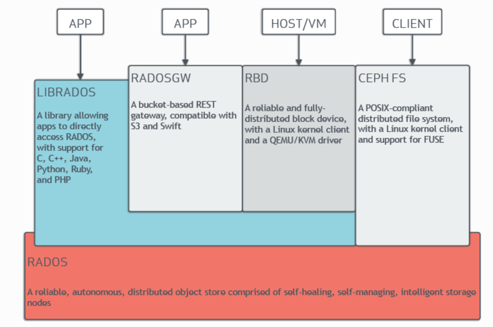
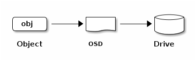

<h1 align="center">关于Ceph</h1>

## 1.Ceph的架构

Ceph 独特地在一个统一的系统中提供***对象（*object*）、块（block）和文件存储（file storage）***。

Ceph 高度可靠、易于管理且免费。 Ceph 的强大功能可以改变您公司的 IT 基础设施以及您管理大量数据的能力。 Ceph 提供非凡的可扩展性——数千个客户端访问 PB 到 EB 的数据。 Ceph 节点利用商用硬件和智能守护进程，Ceph 存储集群可容纳大量节点，这些节点相互通信以动态复制和重新分配数据。

### 1.Ceph存储集群

Ceph 提供基于 RADOS 的无限可扩展 Ceph 存储集群，RADOS 是一种可靠的分布式存储服务，它使用每个节点中的智能来保护其存储的数据并将该数据提供给客户端。

Ceph的存储集群由多种守护进程组成：

- Ceph Monitor

  > Ceph Monitor维护集群映射的主副本，并将其提供给 Ceph 客户端。 Ceph 集群中存在多个Monitor，可确保在其中一个Monitor守护进程或其主机发生故障时的可用性。

- Ceph OSD Deamon

  > Ceph OSD 守护进程用于，检查其***自身状态***和***其他 OSD 的状态***并向Monitor报告。

- Ceph Manager

  > Ceph Manager 充当监控、编排和插件模块的Endpoint。

- Ceph Metadata Server（MDS）

  > 当使用CephFS提供文件服务时，Ceph元数据服务器（MDS）管理***文件元数据***。

存储集群客户端和 Ceph OSD 守护进程，使用 CRUS 算法来计算有关数据位置的信息。通过使用 CRUSH 算法，客户端和 OSD 可以避免中央查找表造成的瓶颈。 Ceph 的高级功能包括通过 `librados` 与 Ceph 存储集群的本机接口以及构建在 `librados` 之上的许多服务接口。

#### 1. ***存储数据：***

Ceph 存储集群从 Ceph 客户端接收数据——无论是通过 ***Ceph 块设备***、***Ceph 对象存储***、***Ceph 文件系统***还是您使用 `librados` 创建的自定义实现。 Ceph存储集群将接收到的数据，存储为***RADOS对象***。每个对象都存储在，***对象存储设备（Object Storage Device）***（也称为“OSD”）上。 Ceph OSD 控制存储驱动器上的***读、写和复制***操作。默认的 BlueStore 后端以单一的、类似数据库的方式存储对象。

Ceph OSD 守护进程，将数据作为对象，存储在平面命名空间中。这意味着对象不存储在目录层次结构中。对象具有*标识符*、*二进制数据*和*由名称/值对组成的元数据*。 Ceph 客户端确定对象数据的语义。例如，CephFS 使用元数据来存储文件属性，例如文件所有者、创建日期和最后修改日期。

*** 注： ***Object ID 在整个集群中都是唯一的，而不仅仅是本地文件系统。

#### 2. ***可扩展性和高可用性：***

在传统架构中，客户端与集中式组件通信。这个集中式组件可能是网关、代理、API 或外观。这种集中式组件充当***复杂子系统的单一入口点***。依赖于这种集中式组件的架构存在单点故障，并且会导致性能和可扩展性受到限制。如果集中式组件出现故障，整个系统将变得不可用。

Ceph 消除了这个集中式组件。这使得客户端能够直接与 Ceph OSD 交互。 Ceph OSD 在其他 Ceph 节点上，创建对象副本，以确保***数据安全和高可用性***。 Ceph 还使用Monitor集群，来确保高可用性。为了消除中心化，Ceph 使用了一种称为 CRUSH 的算法。

**CRUSH介绍：**

Ceph 客户端和 Ceph OSD 守护进程，都使用 CRUSH 算法来计算，有关对象位置的信息，而不是依赖于中央查找表。 所以CRUSH 提供了比旧方法更好的数据管理机制；并且 CRUSH 通过将工作分配给，集群中的*所有 OSD 守护进程*以及*与它们通信的所有客户端*来实现大规模扩展。 CRUSH 使用智能数据复制来确保弹性，更适合超大规模存储。

**集群MAP：**

为了使 Ceph 集群正常运行，Ceph 客户端和 Ceph OSD 必须拥有有关集群拓扑的最新信息。当前信息存储在“集群MAP”中，它实际上是五个MAP的集合。构成集群MAP的五个图是：

1. **The Monitor Map**：

   > 包含集群 `fsid` 、每个Monitor的位置、名称、地址和 TCP 端口。监控图指定了当前的纪元、监控图的创建时间以及监控图的最后修改时间。要查看Monitor图，请运行 ***`ceph mon dump`***

2. **The OSD Map:**

   > 包含集群 `fsid` 、OSD Map 创建时间、OSD Map 最后修改时间、池列表、副本大小列表、PG 编号List以及OSD 及其Status的列表（例如， `up` 、 `in` ）。要查看 OSD Map，请运行 ***`ceph osd dump`*** 。

3. **The PG Map:**

   > 包含 PG 版本、Timestamp、最后一个 OSD 地图纪元、完整比率以及每个Placement Group的详细信息。这包括 *PG ID、Up Set、Acting Set、PG 的状态*（例如 `active + clean` ）以及每个池的数据使用统计信息。

4. **The CRUSH Map:**

   > 包含存储设备列表、故障域层次结构（例如 `device` 、 `host` 、 `rack` 、 `row` 、 `room` ），以及存储数据时，遍历层次结构的规则。要查看 CRUSH 映射，请运行 ***`ceph osd getcrushmap -o {filename}`*** ，然后通过运行 ***`crushtool -d {comp-crushmap-filename} -o {decomp-crushmap-filename}`*** 对其进行反编译。使用文本编辑器或 `cat` 查看反编译后的地图。

5. **The MDS Map:** 

   > 包含当前 MDS 地图纪元、地图创建时间以及上次更改时间。它还包含用于存储元数据的池、元数据服务器列表以及哪些元数据服务器是 `up` 和 `in` 。要查看 MDS 映射，请执行 ***`ceph fs dump`*** 。

每个Map都维护其操作状态更改的历史记录。 Ceph Monitor维护集群映射的主副本。该主副本包括*集群成员*、*集群状态*、*集群更改*以及*记录 Ceph 存储集群整体运行Status*的信息。

**高可用性Monitors：**

Ceph 客户端必须联系 Ceph Monitor并获取集群Map的，当前副本，以便从 Ceph 集群读取数据或向其中写入数据。

Ceph 集群可以仅使用单个Monitor来正常运行，但是只有单个Monitor的 Ceph 集群存在单点故障：如果Monitor出现故障，Ceph 客户端将无法读取或写入数据数据到集群。

Ceph 利用Monitor集群来提高可靠性和容错能力。但是，当使用Monitor集群时，集群中的一个或多个Monitor可能会由于延迟或其他故障而落后。Ceph 通过要求多个Monitor实例就集群状态达成一致来减轻这些负面影响。为了在Monitor之间就集群状态达成共识，Ceph 使用 Paxos 算法和大多数Monitor（例如，1个；包含3个Monitor的集群中的两个Monitor；包含5个Monitor的集群中的3个监视器；包含6个监视器的集群中的4个监视器）。

**高可用性身份验证：**

Ceph 使用 `cephx` 身份验证系统对用户和守护程序进行身份验证，并防止中间人攻击。

### 2.Ceph协议

### 3.Ceph客户端

## 2.

