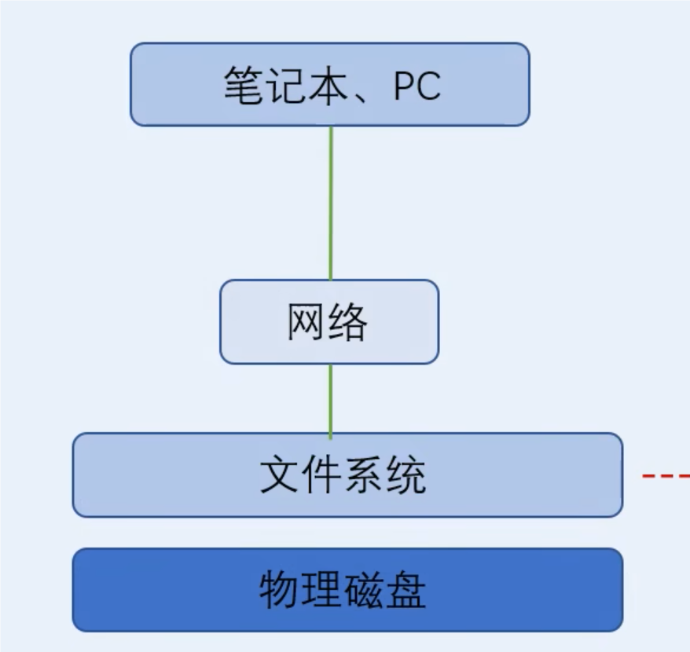

<h1 align="center">块、文件和对象存储的概述</h1>

根据不同的分类方法，存储也会被分为不同类型；但是存储的最终目的都是：**存放数据**。

分类简介：

> 1. 本地存储、外置存储
> 2. DAS（Direct Attached Storage）、SAN（Storage Area Network）、NAS（Network Attached Storage）
> 3. 块存储、文件存储、对象存储

***什么是块存储：***

> 块存储指的是块设备；一切以磁盘形式存在的存储都是块设备，即块存储。
>
> 1. 块存储强调的是裸磁盘
> 2. 所有以磁盘形式直接提供给主机或服务器访问的存储都是块存储

***文件存储：***

> "块存储"+"文件系统"打包后，对外提供存储服务（NAS）。
>
> 
>
> 文件存储和块存储的区别：
>
> 1. 文件存储的存储端，多了一层文件系统，通过文件系统的调度后，再对外提供存储资源
> 2. 块存储使用时，文件系统实际上是在客户端里面；而文件存储的文件系统是在存储端，也可以说是服务端。
> 3. 文件存储易于共享

***对象存储：***

> Object存储是一种全新的存储架构。综合了块存储和文件存储的优点，
>
> ***特点：***速度快、易于共享、扩展性强。
>
> 对象存储使用的是全新的二层结构的文件系统
>
> 文件存储使用的是传统的目录结构的文件系统

## 关于对象存储的详解

***定义：***

>  对象存储是一种用于存储，非结构化数据的数据存储架构，它将数据划分为 ***`units—objects`*** 并将它们存储在结构扁平的，数据环境中。每个对象都包含 ***`data`*** 、***`metadata`***和***`唯一标识符（UUID）`***，App可以使用这些标识符轻松访问和检索。

***对象存储如何工作：***

> 通过对象存储，文件的`数据块`、`与其相关元数据`和自定义标识符一起，作为一个Object保存在一起，并放置在称为存储池的平面数据环境中。
>
> 当您想要访问数据时，对象存储系统，将使用`唯一标识符（UUID）`和`Metadata`来查找您需要的对象，例如图像或音频文件。您还可以自定义元数据，从而允许添加更多可用于其他目的的上下文，例如数据分析检索。
>
> 您可以使用 ***`RESTful API、HTTP`*** 来查找和访问对象，  以 ***`HTTPS`***查询对象元数据。由于对象存储在全局存储池中，因此可以快速轻松地找到所需的确切数据。此外，扁平化环境使您能够快速扩展，即使是 PB 或 EB 负载。存储池可以分布在多个对象存储设备和地理位置上，从而实现无限扩展。随着数据的增长，您只需向池中添加更多存储设备即可。
>
> 对象存储的优势（例如其弹性和可扩展性）使其成为管理云基础设施中非结构化数据的理想选择。那么，什么是云中的对象存储？顾名思义，基于对象的存储是一种按需云服务。事实上，云对象存储是大多数主要云服务提供商的主要存储格式。

